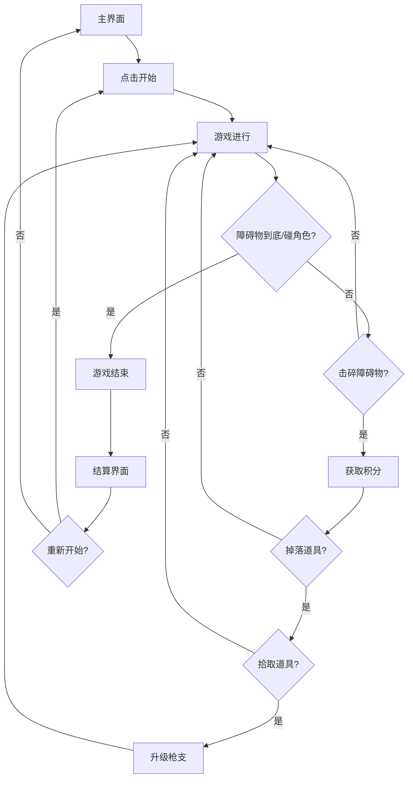

# 像素风格射击游戏 — 产品需求文档 (PRD)

## 1. 产品概述

像素风格射击游戏是一款竖屏无限射击休闲游戏，玩家操控像素角色在双通道间切换，自动射击击碎从上方滚落的障碍物获取积分。核心体验为快节奏射击+躲避+升级的爽快感，目标用户为休闲游戏玩家。

- 解决的问题：提供一款操作极简（仅需点击）、反馈强烈、节奏紧凑的休闲射击游戏
- 目标市场：H5小游戏、移动端休闲游戏用户

## 2. 核心功能

### 2.1 功能模块

1. **游戏主界面**：开始按钮、最高分显示、操作说明
2. **游戏画面**：双通道场景、角色、障碍物、子弹、道具、HUD信息
3. **结算界面**：本次得分、最高分、存活时间、击碎数量、最高连击

### 2.2 页面详情

| 页面名称 | 模块名称 | 功能描述 |
|---------|---------|---------|
| 游戏主界面 | 标题区 | 像素字体游戏标题，闪烁动画 |
| 游戏主界面 | 开始按钮 | 脉冲动画的"点击开始"按钮 |
| 游戏主界面 | 最高分 | 显示历史最高分 |
| 游戏主界面 | 操作说明 | 简洁的点击切换通道图标说明 |
| 游戏画面 | 双通道场景 | 左右两条通道+中央分隔带，深色城市废墟背景 |
| 游戏画面 | 角色控制 | 点击切换通道，自动射击，平滑过渡动画 |
| 游戏画面 | 障碍物系统 | 10级障碍物从上方下落，显示生命值条 |
| 游戏画面 | 枪支系统 | 10级枪支，不同弹道和射速 |
| 游戏画面 | 道具系统 | 击碎障碍物掉落枪支道具，触碰拾取 |
| 游戏画面 | 积分系统 | 击碎积分+连击倍率 |
| 游戏画面 | HUD | 枪支等级、积分、连击数 |
| 游戏画面 | 特效 | 命中粒子、爆炸碎片、伤害飘字、枪口火焰 |
| 结算界面 | 得分展示 | 数字滚动动画显示本次得分 |
| 结算界面 | 统计信息 | 最高分、存活时间、击碎数量、最高连击、使用枪支列表 |
| 结算界面 | 操作按钮 | "再来一次"和"返回"按钮 |

## 3. 核心流程

用户打开游戏 → 看到主界面 → 点击开始 → 角色在左通道自动射击 → 障碍物从上方下落 → 点击屏幕切换通道躲避/射击 → 击碎障碍物获取积分 → 拾取枪支道具升级武器 → 难度逐步提升 → 障碍物到底或碰角色 → 游戏结束 → 结算界面 → 重新开始或返回

## 4. 用户界面设计

### 4.1 设计风格

- **主色调**：深色背景（#0a0a1a）+ 霓虹绿（#00ff88）作为主强调色 + 橙红（#ff6644）作为次强调色
- **按钮风格**：像素风格圆角按钮，霓虹发光边框，hover时发光增强
- **字体**：像素字体（Press Start 2P / 像素宋体），标题16px，正文8px
- **布局风格**：竖屏全屏游戏画面，HUD叠加在画面上方
- **图标风格**：8-bit像素图标，简洁辨识度高

### 4.2 页面设计概览

| 页面名称 | 模块名称 | UI元素 |
|---------|---------|--------|
| 游戏主界面 | 标题区 | 像素字体大标题，霓虹绿发光，闪烁动画 |
| 游戏主界面 | 开始按钮 | 霓虹绿边框按钮，脉冲缩放动画 |
| 游戏画面 | 场景 | 深色背景，左右通道灰色地面，中央虚线分隔 |
| 游戏画面 | 角色 | 16×24像素小人，持枪姿态，切换时滑动动画 |
| 游戏画面 | 障碍物 | 像素风格方块，上方绿色生命值条，受击闪白 |
| 游戏画面 | 子弹 | 小像素弹丸，不同枪支不同颜色/形状 |
| 游戏画面 | HUD | 左上枪支图标+等级，中上积分，右上连击数 |
| 结算界面 | 得分区 | 大号像素数字，滚动计数动画 |

### 4.3 响应式设计

- 竖屏优先设计，逻辑分辨率240×400像素
- PC端：居中显示竖屏游戏区域，两侧留黑边
- 移动端：全屏适配，触屏点击操作
- 横屏时提示旋转设备

### 4.4 3D场景指导

- **环境**：深色城市废墟风格背景，缓慢滚动增加纵深感
- **灯光**：环境光 + 角色跟随点光源，营造霓虹氛围
- **相机**：正交相机，固定俯视角度，低分辨率渲染+pixelated缩放
- **交互**：点击切换通道，自动射击，道具拾取
- **动画**：障碍物下落、子弹飞行、粒子爆炸、角色切换滑动
- **性能**：移动端降低粒子数、关闭阴影，保持60fps
