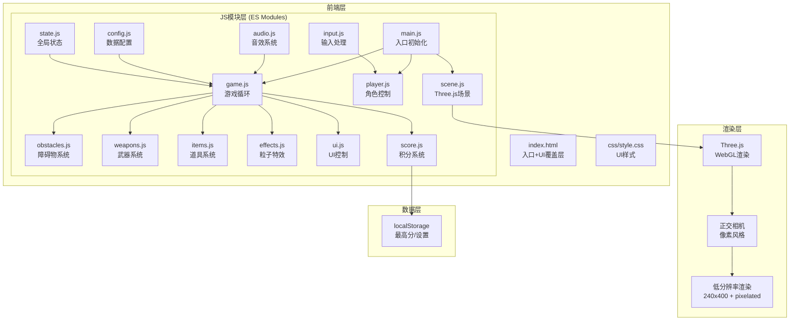

# 像素风格射击游戏 — 技术架构文档

## 1. 架构设计



## 2. 技术说明

- **前端框架**：无框架，原生JavaScript + Three.js（游戏不需要React/Vue的组件模型）
- **渲染引擎**：Three.js 0.164+ (WebGL)
- **模块系统**：ES Modules (import/export)，开发阶段使用importmap零构建
- **音频**：Web Audio API，程序化生成音效（OfflineAudioContext预渲染）
- **数据存储**：localStorage（最高分、设置）
- **构建工具**：开发阶段零构建，生产环境可选简易打包

**参考项目**：`xuancaijiezou3D-main`（Three.js弹跳球游戏），采用相同的模块化架构模式：
- 集中式状态管理 (`state.js`)
- 输入策略模式 (`input.js`)
- 程序化音效 (`audio.js`)
- Shader粒子系统 (`effects.js`)
- 固定时间步物理 (`game.js`)
- 移动端动态降级

## 3. 路由定义

本项目为单页面游戏，无路由：

| 路径 | 用途 |
|------|------|
| / | 游戏唯一入口，包含所有UI状态（主界面/游戏/结算）通过显示/隐藏覆盖层切换 |

## 4. 项目结构

```
pixel-shooter/
├── index.html              # 入口HTML，UI覆盖层，importmap配置
├── css/
│   └── style.css           # UI样式，像素字体，动画
└── js/
    ├── main.js             # 入口模块：初始化各子系统
    ├── config.js           # 常量配置：枪支表、障碍物表、难度曲线
    ├── state.js            # 全局状态：游戏运行时状态对象
    ├── scene.js            # 场景初始化：Three.js场景、正交相机、灯光
    ├── player.js           # 玩家角色：像素小人创建、通道切换动画
    ├── obstacles.js        # 障碍物系统：生成、下落、生命值、碰撞
    ├── weapons.js          # 武器系统：射击逻辑、弹道计算、子弹管理
    ├── items.js            # 道具系统：枪支道具掉落、拾取
    ├── effects.js          # 特效系统：命中粒子、爆炸碎片、伤害飘字
    ├── audio.js            # 音效系统：程序化枪声、命中音、爆炸音
    ├── input.js            # 输入处理：PC鼠标点击/移动端触屏点击
    ├── ui.js               # UI控制：HUD更新、开始/结算界面
    ├── game.js             # 游戏循环：主循环、难度递增
    └── score.js            # 积分系统：连击计算、最高分存储
```

## 5. 核心数据模型

### 5.1 枪支配置 (WEAPONS)

| 字段 | 类型 | 说明 |
|------|------|------|
| level | number | 等级 1-10 |
| name | string | 名称 |
| damage | number | 单发攻击力 |
| fireRate | number | 射速(发/秒)，-1表示持续 |
| type | string | 弹道类型: single/dual/spread/shotgun/pierce/rapid/explosive/beam |
| bulletSize | number | 子弹像素尺寸 |
| spreadAngle | number | 散射角度(霰弹枪) |
| pierceCount | number | 穿透数量(狙击枪) |
| explosionRadius | number | 爆炸范围(火箭筒) |
| audio | object | 音效参数: freq, type, attack, decay, sustain, duration, release |

### 5.2 障碍物配置 (OBSTACLES)

| 字段 | 类型 | 说明 |
|------|------|------|
| level | number | 等级 1-10 |
| name | string | 名称 |
| hp | number | 生命值 |
| width | number | 像素宽度 |
| height | number | 像素高度 |
| speed | number | 基础下落速度 |
| score | number | 击碎积分 |
| material | string | 材质类型: wood/stone/metal/cloth |
| color | number | 16进制颜色值 |

### 5.3 难度阶段配置 (DIFFICULTY_STAGES)

| 字段 | 类型 | 说明 |
|------|------|------|
| name | string | 阶段名称 |
| timeRange | [number, number] | 时间范围(秒) |
| levelRange | [number, number] | 障碍物等级范围 |
| spawnInterval | number | 生成间隔(秒) |
| speedMult | number | 下落速度倍率 |
| maxObstacles | number | 同时最大障碍物数 |

### 5.4 游戏状态 (state)

| 字段 | 类型 | 说明 |
|------|------|------|
| scene/camera/renderer | object | Three.js核心对象 |
| currentChannel | 'left'/'right' | 当前通道 |
| playerX/playerTargetX | number | 角色位置/目标位置 |
| currentWeapon | number | 当前枪支等级(0-9索引) |
| fireTimer | number | 射击计时器 |
| bullets | array | 活跃子弹列表 |
| obstacles | array | 活跃障碍物列表 |
| items | array | 活跃道具列表 |
| score | number | 当前积分 |
| combo | number | 连击数 |
| gameTime | number | 游戏时间 |
| gameActive | boolean | 游戏是否进行中 |
| isMobile | boolean | 是否移动端 |
